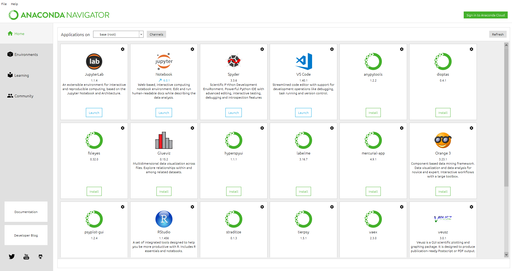
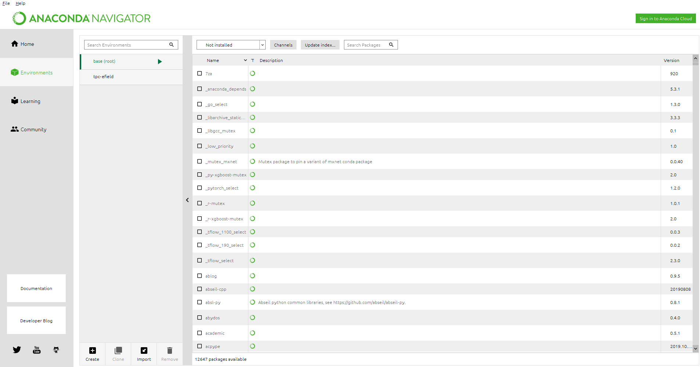
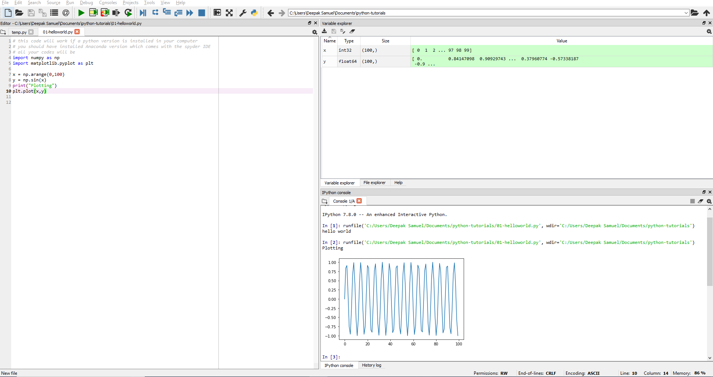

# python-tutorials
 A step-by-step introduction of python for physics students
# Step 1: Anaconda installation
You will have to install the Anaconda distribution from this link: https://www.anaconda.com/
# Step 2: Open Anaconda Navigator
Along with Anaconda, another program called Anaconda Navigator (a sort of package manager) is installed. You can open it by searching for it in your Windows machine or by typing conda-navigator or anaconda-navigator on linux-based machine. You can also find it in Ubuntu launch pad. 

# Step 3: How to install python libraries
Anaconda navigator will help install python libraries that is apt for your system (Using other package managers like pip will mess up your python installation, if you are using Anaconda). 
>Click on "Environments" in the navigator which will take you to another page. You can see the list of installed packages or search for new packages and install them directly. 

>For example, if you want to install the numpy package, you will enter "numpy" (without quotes) and select "not installed" in the drop down box next to "Channels". 

>If the package shows up, click on it and an install button shows up at the bottom.

# Step 4: Opening Spyder
Click on Spyder icon to open the Spyder IDE. This is where you will write your code.
# Step 5: Using the Spyder IDE
The defautl IDE has 3 sub-windows in it. 
>On the left side, you have space to write your code (we will call it code window). 

>On the right side there are two windows. The bottom console will display the output of your code (we will call it output console). The top window has many sub options. 

>You can view the value of variables/tables used or can use it to check the files in a particular directory (useful if your program writes or reads a file). 

# Step 6: Running your code in Spyder IDE
To compile or to run your code in Spyder:
>Click on the green triangle on menu and you will you see the output (or errors)in the output console.

# Step 7: Using other IDEs
Visual Studio Code is equally good. You can try it but Spyder is good for beginners in my opinion.

